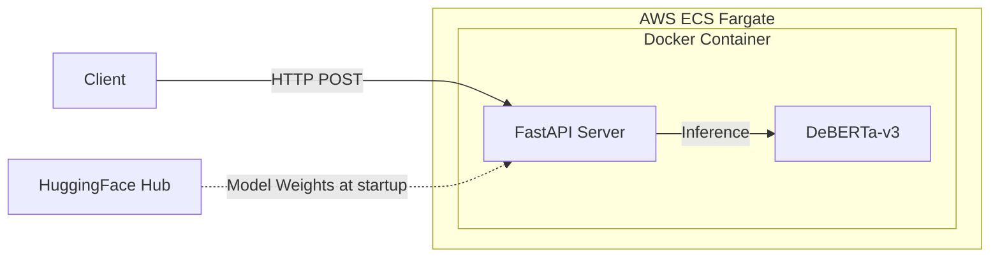

# PII Redaction

[](https://www.python.org/)
[](https://fastapi.tiangolo.com/)
[](https://huggingface.co/bengid)
[](https://huggingface.co/bengid/pii-redaction-deberta-base)
[](https://pii-redaction.bengid.dev/demo)
[](https://github.com/ben-gid/pii_redaction/actions/workflows/ci.yml)
[](https://github.com/ben-gid/pii_redaction/actions/workflows/cd.yml)

A production-ready **API and CLI** that detects and redacts personally identifiable information (PII) from English text. Uses a fine-tuned DeBERTa-v3 NER model to identify 27 entity types, then replaces each span with a typed placeholder (e.g. `[EMAIL]`, `[TEL]`). Built to pre-process text before LLM pipelines and to assist with HIPAA/GDPR compliance.

**Stack:** DeBERTa-v3 · HuggingFace Transformers · FastAPI · Docker · AWS ECS Fargate

**Models on HuggingFace Hub:**
- [`bengid/pii-redaction-deberta-base`](https://huggingface.co/bengid/pii-redaction-deberta-base) — 86M params, macro F1 0.9557 (best accuracy)
- [`bengid/pii-redaction-deberta-small`](https://huggingface.co/bengid/pii-redaction-deberta-small) — 44M params, macro F1 0.9517 (best latency)
- [`bengid/pii-redaction-deberta-xsmall`](https://huggingface.co/bengid/pii-redaction-deberta-xsmall) — 22M params, macro F1 0.9424 (smallest footprint)

---

## Table of Contents

1. [Architecture](#architecture-diagram)
2. [API Usage](#api-usage)
3. [Entity Types](#entity-types-supported)
4. [Model Performance](#model-performance)
5. [Local Setup](#local-setup)
6. [Roadmap](#roadmap)
7. [Engineering Challenges](#engineering-challenges)
8. [Implementation Log](#implementation-log)

---

## Architecture Diagram



---

## API Usage

The API is live at [`https://pii-redaction.bengid.dev/demo`](https://pii-redaction.bengid.dev/demo).

> [!NOTE]
> The public demo is rate-limited. The `/redact` endpoint requires an `X-API-Key` header; the key is not publicly distributed. Use the interactive demo UI at `/demo` to try the API without a key.

**Request:**
```bash
curl -X POST "https://pii-redaction.bengid.dev/redact" \
     -H "Content-Type: application/json" \
     -H "X-API-Key: <your-key>" \
     -d '{"text": "John Doe lives at 123 Main St. Call him at 555-867-5309.", "threshold": 0.5}'
```

**Response:**
```json
{
  "redacted": "[GIVENNAME1] [LASTNAME1] lives at [BUILDING] [STREET]. Call him at [TEL].",
  "entities": [
    { "entity": "GIVENNAME1", "text": "John",        "start": 0,  "end": 4,  "score": 0.998 },
    { "entity": "LASTNAME1",  "text": "Doe",          "start": 5,  "end": 8,  "score": 0.994 },
    { "entity": "BUILDING",   "text": "123",          "start": 18, "end": 21, "score": 0.981 },
    { "entity": "STREET",     "text": "Main St.",     "start": 22, "end": 30, "score": 0.976 },
    { "entity": "TEL",        "text": "555-867-5309", "start": 43, "end": 55, "score": 0.999 }
  ],
  "model": "bengid/pii-redaction-deberta-small",
  "threshold": 0.5
}
```

**Endpoints:**

| Method | Path | Description |
|--------|------|-------------|
| `POST` | `/redact` | Detect and redact PII; `threshold` is per-request |
| `GET`  | `/health` | Liveness check |
| `GET`  | `/model-info` | Model metadata and entity type list |
| `GET`  | `/demo` | Interactive dark-mode demo UI |
| `GET`  | `/docs` | Swagger UI |

---

## Entity Types Supported

The model detects and redacts **27 PII entity types**, grouped by category:

| Category | Entities |
|----------|----------|
| **Identity** | `GIVENNAME1`, `GIVENNAME2`, `LASTNAME1`, `LASTNAME2`, `LASTNAME3`, `TITLE`, `SEX` |
| **Contact** | `EMAIL`, `TEL` |
| **Location** | `BUILDING`, `STREET`, `SECADDRESS`, `CITY`, `STATE`, `POSTCODE`, `COUNTRY`, `GEOCOORD` |
| **Documents** | `IDCARD`, `PASSPORT`, `DRIVERLICENSE`, `SOCIALNUMBER` |
| **Credentials** | `USERNAME`, `PASS`, `IP` |
| **Temporal** | `DATE`, `TIME`, `BOD` |

---

## Model Performance

Evaluated on the English validation subset (3,973 examples) of [`ai4privacy/pii-masking-300k`](https://huggingface.co/datasets/ai4privacy/pii-masking-300k).

| Model | Macro F1 | Precision | Recall | Params | Inference* | Best For |
|-------|----------|-----------|--------|--------|------------|----------|
| [Base](https://huggingface.co/bengid/pii-redaction-deberta-base) | **0.9557** | 0.9507 | 0.9607 | 86M | ~11.7ms | Accuracy |
| [Small](https://huggingface.co/bengid/pii-redaction-deberta-small) | 0.9517 | 0.9464 | 0.9572 | 44M | **~6.5ms** | Latency |
| [XSmall](https://huggingface.co/bengid/pii-redaction-deberta-xsmall) | 0.9424 | — | — | **22M** | ~11.6ms† | Memory |

*Inference on RTX 5070, single sample.
†XSmall latency note: see [model card](https://huggingface.co/bengid/pii-redaction-deberta-xsmall/#latency-note).

<details>
<summary>Per-entity F1 breakdown (base model)</summary>

| Entity | F1 | Support |
|--------|----|---------|
| BOD | 0.9774 | 1,124 |
| BUILDING | 0.9829 | 963 |
| CITY | 0.9763 | 989 |
| COUNTRY | 0.9639 | 757 |
| DATE | 0.9295 | 837 |
| DRIVERLICENSE | 0.9563 | 1,142 |
| EMAIL | 0.9864 | 1,206 |
| GEOCOORD | 0.9806 | 104 |
| GIVENNAME1 | 0.8751 | 904 |
| GIVENNAME2 | 0.8175 | 255 |
| IDCARD | 0.9436 | 1,300 |
| IP | 0.9942 | 1,028 |
| LASTNAME1 | 0.8497 | 1,158 |
| LASTNAME2 | 0.7557 | 313 |
| LASTNAME3 | 0.7302 | 105 |
| PASS | 0.9741 | 784 |
| PASSPORT | 0.9602 | 1,173 |
| POSTCODE | 0.9732 | 954 |
| SECADDRESS | 0.9705 | 440 |
| SEX | 0.9635 | 969 |
| SOCIALNUMBER | 0.9677 | 1,285 |
| STATE | 0.9840 | 995 |
| STREET | 0.9749 | 967 |
| TEL | 0.9673 | 991 |
| TIME | 0.9792 | 1,825 |
| TITLE | 0.9685 | 906 |
| USERNAME | 0.9687 | 1,295 |

> [!NOTE]
> Name entities (`GIVENNAME`, `LASTNAME`) score 0.10–0.20 below macro F1. Secondary/tertiary occurrences (e.g. `LASTNAME2`, `LASTNAME3`) have far less training support (105–313 examples vs. 900–1,100 for primaries), and names are inherently context-dependent without surrounding cues like titles or formal structure.

</details>

---

## Local Setup

### Prerequisites

- **Docker** — for running the API server (CPU-only, no GPU required)
- **[uv](https://docs.astral.sh/uv/)** — for running the CLI (`pip install uv`)
- Python 3.14+

### Run the API with Docker

```bash
docker build -t pii-redaction-api .
docker run -p 8000:8000 pii-redaction-api
```

Then open [http://localhost:8000/demo](http://localhost:8000/demo) for the interactive UI, or [http://localhost:8000/docs](http://localhost:8000/docs) for Swagger.

> [!NOTE]
> The Docker image uses CPU-only PyTorch. For GPU inference, install `torch` with CUDA locally and use the CLI.

### Use the CLI directly

```bash
# Redact inline text (uses the small model by default)
uv run python cli/redact.py --text "My email is john@example.com"

# Redact a file and save structured JSON output
uv run python cli/redact.py --file input.txt --output_path out.json

# Use the larger base model with a higher confidence threshold
uv run python cli/redact.py --text "Call me at 555-867-5309" --model_variant base --threshold 0.5
```

<details>
<summary>All CLI arguments (<code>--help</code>)</summary>

```
usage: redact.py [-h] [--text TEXT] [--file FILE]
                 [--model_variant {small,base,xsmall}]
                 [--threshold THRESHOLD] [--output_path OUTPUT_PATH]
                 [--stride STRIDE] [--max_length MAX_LENGTH]

Detect and redact PII entities in text using a DeBERTa-v3 model.

options:
  --text TEXT               Text to redact (inline). Mutually exclusive with --file.
  --file FILE               Path to a file whose contents should be redacted.
  --model_variant           Model variant to use: small (default), base, xsmall.
  --threshold THRESHOLD     Minimum confidence score for keeping an entity. Default: 0.3.
  --output_path OUTPUT_PATH If provided, JSON response is written to this file.
  --stride STRIDE           Overlap ratio between consecutive chunks (0-1). Default: 0.5.
  --max_length MAX_LENGTH   Max model input length in tokens. Default: 512.
```

</details>

---

## Roadmap

- [ ] Upgraded model for better `GIVENNAME` and `LASTNAME` F1 scores
- [ ] HuggingFace Spaces Gradio demo with `gr.HighlightedText`
- [ ] `/pseudonymize` endpoint (consistent fake-value replacement across a document)

---

<details>
<summary><strong>Engineering Challenges</strong></summary>

- **SentencePiece offset mismatch** — DeBERTa's SentencePiece tokenizer includes leading whitespace in the next token's offset, so the dataset's `privacy_mask` start index (which points to the first non-whitespace character) doesn't match any token offset. Fixed by switching from `offset[0] >= start and offset[1] <= end` to `offset[1] > start and offset[0] < end` (overlap-based check) and using `offset[0] <= start` for the B- prefix instead of `offset[0] == start`.

- **NaN gradients from hidden fp16** — The model loaded weights in fp16 even though `fp16=False` and `bf16=True` were set, causing all weights to become NaN and the model to predict only `O`. Had to manually iterate `model.named_modules()` and cast every module to `torch.float32`.

- **Name entities are structurally harder** — `GIVENNAME` and `LASTNAME` entities consistently score ~0.10–0.20 below macro F1, driven by limited training support for secondary/tertiary occurrences (`LASTNAME2/3`, `GIVENNAME2`) and names being inherently context-dependent.

- **Tokenizer differences across architectures** — DistilBERT (WordPiece), DeBERTa (SentencePiece), and RoBERTa (BPE) each tokenize differently. The offset-alignment logic had to be rewritten per tokenizer.

- **Subword labeling convention** — Continuation subwords are masked with `-100` during training, so `aggregation_strategy="simple"` produces partial entity detections. Must use `aggregation_strategy="first"` at inference.

</details>

---

<details>
<summary><strong>Implementation Log</strong></summary>

- [x] **Phase 1 — Data & Baseline**
  - Loaded and explored `ai4privacy/pii-masking-300k`
  - Filtered to English only (29,908 train / 3,973 val / 3,973 test)
  - Removed `CARDISSUER` (only 5 examples)
  - Created BIO label mappings for 27 entity types
  - Trained DistilBERT baseline pipeline

- [x] **Phase 2 — Model & Training**
  - DeBERTa-v3-base: macro F1 **0.9564** on test set
  - DeBERTa-v3-small: macro F1 **0.9497** on test set
  - DeBERTa-v3-xsmall: macro F1 **0.9422** on test set
  - RoBERTa-base experiment (0.9553 test F1)
  - Custom `WeightedTokenClassificationTrainer` with class-balanced loss
  - Two-phase training (frozen backbone → unfrozen full fine-tune)
  - W&B logging with per-entity F1 and interactive HTML prediction tables
  - Models published to HF Hub: `bengid/pii-redaction-deberta-{base,small,xsmall}`

- [x] **Phase 3 — Redaction Logic**
  - `PIIRedactor` class with chunking, overlap resolution, and redaction
  - Overlapping token chunks with boundary-aligned splitting (paragraph/sentence-aware)
  - Overlap resolution by max confidence score
  - CLI entry point for file/stdin redaction
  - Structured `RedactionResponse` Pydantic schema

- [x] **Phase 4 — FastAPI Service**
  - `POST /redact` — detect and redact PII, threshold per request
  - `GET /health` — liveness check
  - `GET /model-info` — model metadata and entity types
  - API key auth via `X-API-Key` header
  - Model loaded once at startup via lifespan
  - Swagger UI at `/docs`
  - Interactive dark-mode HTML demo page (`GET /demo` and `POST /demo/redact`) with glassmorphism layout
  - Drag-and-drop plain-text file upload to populate input
  - Real-time entity classification with confidence score badges
  - API unit tests for every route

- [x] **Phase 5 — Deployment**
  - Docker build
  - ECR push & ECS Fargate deployment

</details>
